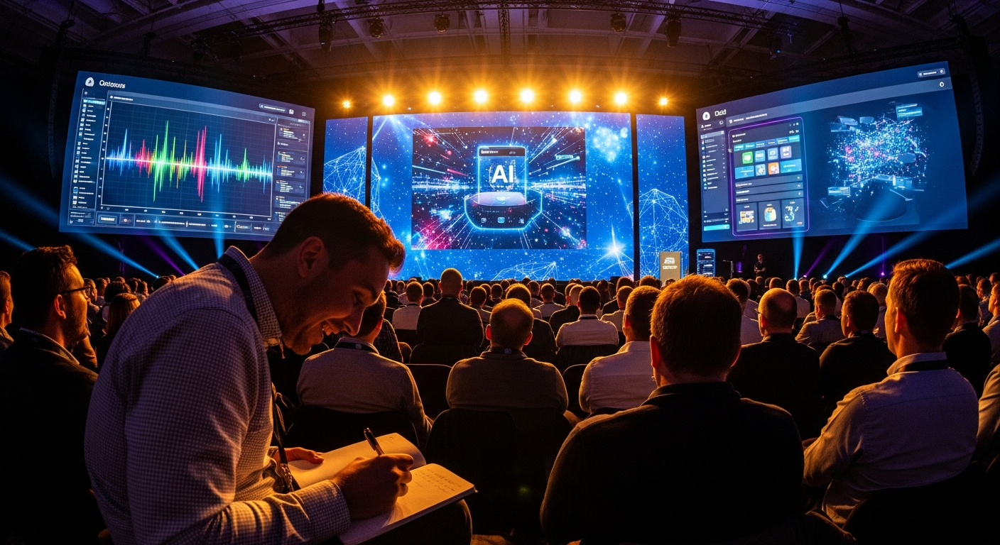
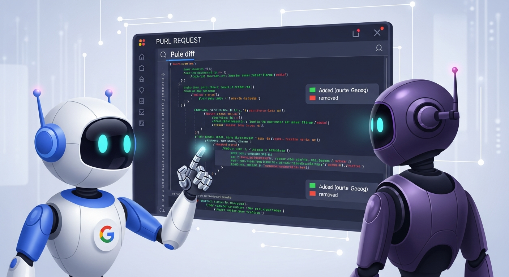
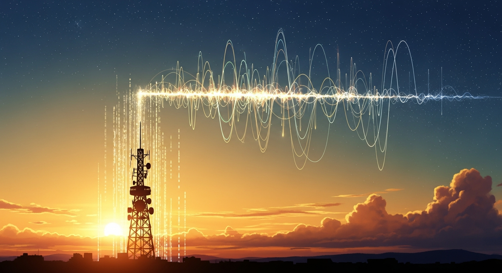

# SessionCast

**From conference notes to radio episodes — fully automated on Google Cloud.**


<!-- 🍌 Nanobanana prompt: a journalist at a conference takes handwritten notes, and those notes transform into radio waves, then into a podcast, then into a YouTube video — shown as a flowing river of data in warm golden tones. 21:9 cinematic -->

---

> *"I took notes for three days in Las Vegas. By the time I got home, those notes had become a radio show."*
>
> — Daisuke Masubuchi, Google Cloud Next '26

**[🇯🇵 日本語版はこちら](docs/README.ja.md)**

---

## What is this?

Drop in your conference notes. Get a radio episode back.

```
  Your notes (text, photos, anything)
          │
          ▼
  ┌───────────────────────────────────────┐
  │                                       │
  │   📝  →  🤖  →  🎙️  →  🎬  →  📺   │
  │  notes  AI script  voices  video  publish │
  │                                       │
  └───────────────────────────────────────┘
          │
          ▼
  Radio episode (YouTube / Podcast)
```

Everything runs on **Google Cloud**. No local GPU. No heavy machine. Works from your phone.

---

## Why it exists — a hotel room in Las Vegas

April 22–24, 2026. **Google Cloud Next '26**, Las Vegas.


<!-- 🍌 Nanobanana prompt: a person taking notes at a massive tech conference, screens behind them showing AI demos, the atmosphere energetic and a bit overwhelming. Warm evening lighting. 16:9 -->

400+ booths. PlayStation × Gemini voice demos. "Weeks of work, one click" — said live on stage. Ten hours of sessions a day.

**The problem: making it stick.**

Photos help. Text notes help. But neither was enough for the density of those three days.

The idea hit me in the hotel room: **radio format sticks.** Dialogue forces clarity. If I can hear it, I remember it.

But I was in sessions all day with no time to write scripts or record audio. So:

**Let AI do all of it.**

```
  Night — drop notes into the pipeline
       ↓
  Morning — yesterday's session is a radio episode
```

That's SessionCast.

> **I wrote about this experience on Note.com.**  
> Radio series (YouTube) coming soon.

---

## How it works — full pipeline

```
  ╔═══════════════════════════════════════════════════════╗
  ║  PHASE 1: Pre-production (planning + scripting)       ║
  ╠═══════════════════════════════════════════════════════╣
  ║                                                       ║
  ║   📄 Your notes                                       ║
  ║       │                                               ║
  ║       ▼                                               ║
  ║   🔍 Research Agent  ← Gemini 2.5 Pro               ║
  ║       │  fact-check, quotes, supplemental context    ║
  ║       │  + image analysis via A2A if photos uploaded ║
  ║       ▼                                               ║
  ║   ✍️  Script Writer Agent  ← Gemini 2.5 Pro          ║
  ║       │  2-host dialogue radio script                ║
  ║       ▼                                               ║
  ║   💾 script.json → GCS                               ║
  ║       │  Firestore: episode status = "script_ready"  ║
  ║                                                       ║
  ╠═══════════════════════════════════════════════════════╣
  ║  PHASE 2: Audio synthesis                             ║
  ╠═══════════════════════════════════════════════════════╣
  ║                                                       ║
  ║   🔔 Firestore "script_ready" trigger                ║
  ║       │                                               ║
  ║       ▼                                               ║
  ║   🎙️  TTS Worker (engine selected per character)     ║
  ║       ├── Kukuri (anime-style JP voice) → VOICEVOX   ║
  ║       └── Matthew (voice clone) → ElevenLabs IVC     ║
  ║       │                                               ║
  ║       ▼                                               ║
  ║   💾 audio.wav → GCS                                 ║
  ║                                                       ║
  ╠═══════════════════════════════════════════════════════╣
  ║  PHASE 3: Video + publishing                          ║
  ╠═══════════════════════════════════════════════════════╣
  ║                                                       ║
  ║   🎬 Remotion Renderer (coming soon)                 ║
  ║       │  slides + audio → video.mp4                  ║
  ║       ▼                                               ║
  ║   📺 Publishing Hub                                   ║
  ║       YouTube / Note.com / GCS archive               ║
  ║                                                       ║
  ╚═══════════════════════════════════════════════════════╝
```

---

## The two hosts

```
  ┌─────────────────────────────┐   ┌─────────────────────────────┐
  │           Kukuri             │   │          Matthew             │
  │                             │   │                             │
  │  🎀 Anime-style JP voice    │   │  🎙️ Real voice clone        │
  │     VOICEVOX engine         │   │     ElevenLabs IVC          │
  │                             │   │                             │
  └─────────────────────────────┘   └─────────────────────────────┘
```

Voice engines are configured per episode in `script.json`.
Fork this repo and you can run it with **your own voice clone**.

---

## Photo upload + AI analysis (A2A)

SessionCast can analyze photos you take at a conference — slides, venue atmosphere, networking events — and weave that context into the script.

```
  PWA upload page (/upload)
       │  drag-and-drop or camera roll
       │  category: slide / atmosphere / general
       ▼
  Firebase Storage → GCS
       │
       ▼
  sessioncast-image-analyzer (Cloud Run, A2A endpoint)
       │  Gemini Vision reads GCS URIs natively
       │  returns: title, key_points, radio_description
       ▼
  Research Agent ingests image analysis
       │  combines with text notes
       ▼
  Script includes visual context from photos
```

The Image Analyzer is a standalone A2A service. Other agents discover it via its **Agent Card** at `/.well-known/agent.json`.

---

## Built with AI — no code written

The most experimental part of SessionCast's development: **almost zero code was written by hand.**

```
  Traditional development:
  idea → spec → coding → testing → done
  ~~~~~~~~~~~~~~~~~~~
  weeks to months

  SessionCast development:
  "I want a pipeline like this" (natural language)
       ↓
  "Switch TTS Worker to ElevenLabs"
       ↓
  "Cloud Build is failing, fix it"
       ↓
  done

  Code written by human: ≈ 0 lines
```

This was the practice of **"design the intent"** — a concept I learned at Google Cloud Next '26. You design *what* you want. AI translates it.

---

## The compounding accuracy problem


<!-- 🍌 Nanobanana prompt: three dominoes each labeled "95%", falling into each other and producing an output labeled "85.7%". Clean, minimal infographic style with red accents. 4:3 -->

A key concept from Google Cloud Next '26:

```
  If each pipeline step is 95% accurate...

  1 step:   ████████████████████ 95.0%

  2 steps:  ██████████████████░░ 90.3%

  3 steps:  █████████████████░░░ 85.7%  ← 14% lost in 3 steps

  5 steps:  ███████████████░░░░░ 77.4%
```

AI pipelines compound errors at every step.

SessionCast makes this measurable:

```
  Each agent step records a confidence score (0.0–1.0)
       ↓
  PipelineAccuracyTracker computes compound accuracy
       ↓
  BigQuery + Looker Studio visualizes accuracy per episode
       ↓
  Target: compound accuracy ≥ 90%
```

---

## AI-Powered CI/CD — coding agent reviews every PR


<!-- 🍌 Nanobanana prompt: a pull request icon being carefully examined by two robot reviewers, one with Google colors, one with Anthropic colors. Clean GitHub-style interface in background. 16:9 -->

Every pull request to this repo is **automatically reviewed by Gemini 2.5 Pro**.

```
  PR opened
       │
       ▼
  Gemini 2.5 Pro reads the diff (via Vertex AI)
       │
       ▼
  Structured review posted as PR comment:
       ├── ✅ Looks good
       └── ⚠️ 2 issues found
               ├── 1. Security issue (must fix)
               ├── 2. Logic bug (should fix)
               └── 3. Code quality (consider)

  Comment /fix on the PR
       │
       ▼
  Claude Code auto-applies the fix and commits
```

This is a pattern from Google Cloud Next '26's "Accelerate CI/CD with Coding Agents" session, **implemented and running on this repo.**

---

## Episode 0: the meta demo

The first episode was intentionally self-referential:

```
  Input:  session-notes.md
          ↑ notes taken at Google Cloud Next '26

  Process: SessionCast pipeline

  Output: a radio episode about SessionCast
          ↑ the tool narrates its own origin story
```

*The tool tells its own creation story.*

This episode is planned to be played at **Google Cloud Next '27**:

```
  ┌────────────────────────────────────────────────────────┐
  │  "Last year at this conference, I took these notes.    │
  │   This morning, the pipeline turned them into this.   │
  │                                                        │
  │   Here's the Looker Studio dashboard:                 │
  │   50 episodes. Compound accuracy: 91.2%."             │
  └────────────────────────────────────────────────────────┘
```

---

## Status

| Component | Status | Notes |
|---|---|---|
| Vertex AI ADK Agents | ✅ running | Research + Script Writer |
| Firebase PWA | ✅ running | Firebase Hosting |
| CI/CD (Gemini review + Claude /fix) | ✅ running | Workload Identity |
| ElevenLabs voice clone (Matthew) | ✅ running | eleven_multilingual_v2 |
| TTS Worker (Cloud Run) | ✅ running | Firestore job queue |
| Local worker (VOICEVOX) | ✅ running | local_worker.py |
| Image Analyzer A2A service | ✅ built | Gemini Vision |
| Photo upload UI (/upload) | ✅ built | Firebase Storage |
| Remotion video renderer | 🚧 in progress | |
| YouTube auto-publish | 📋 planned | |
| Looker Studio dashboard | 📋 planned | |

---

## Fork and run it yourself

Full setup guide — Google Cloud prerequisites, voice clone registration, GitHub Secrets, local testing:

### 👉 [docs/SETUP.md — Setup Guide](docs/SETUP.md)

---

## License

MIT — [LICENSE](LICENSE)

Free to fork, modify, and use commercially. If you present this at a conference, let me know.

---

*Daisuke Masubuchi / [Papukaija LLC](https://papukaija.jp/)*  
*Google Cloud Next '26 → '27 case study in progress*


<!-- 🍌 Nanobanana prompt: a warm and satisfying final frame — a radio tower at sunset, with data streams flowing upward becoming sound waves, becoming stars. 21:9 cinematic -->
